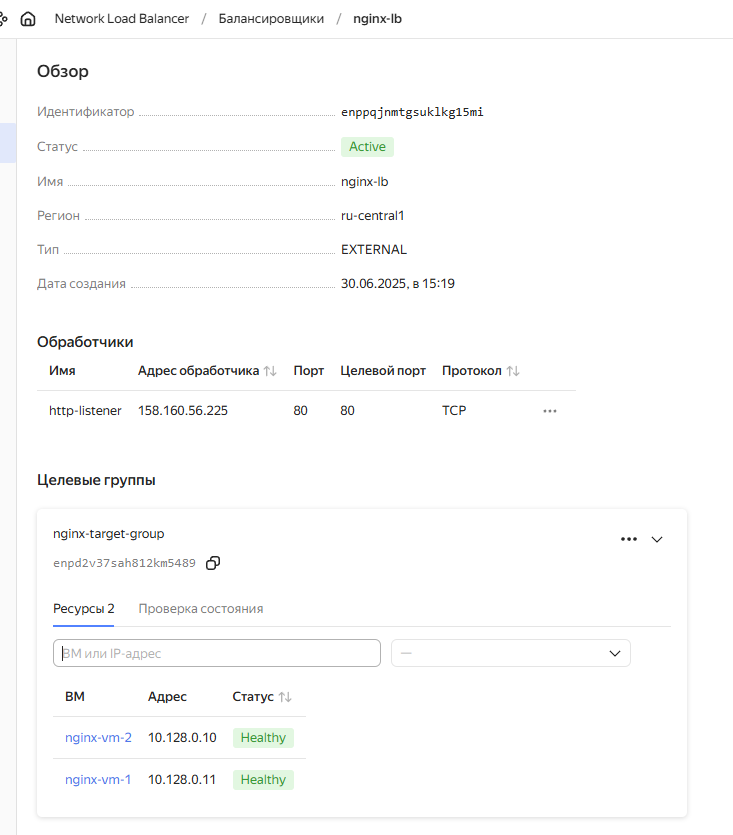
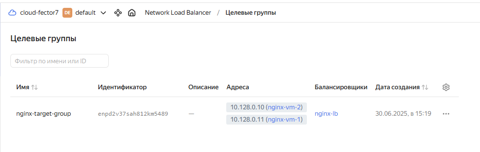
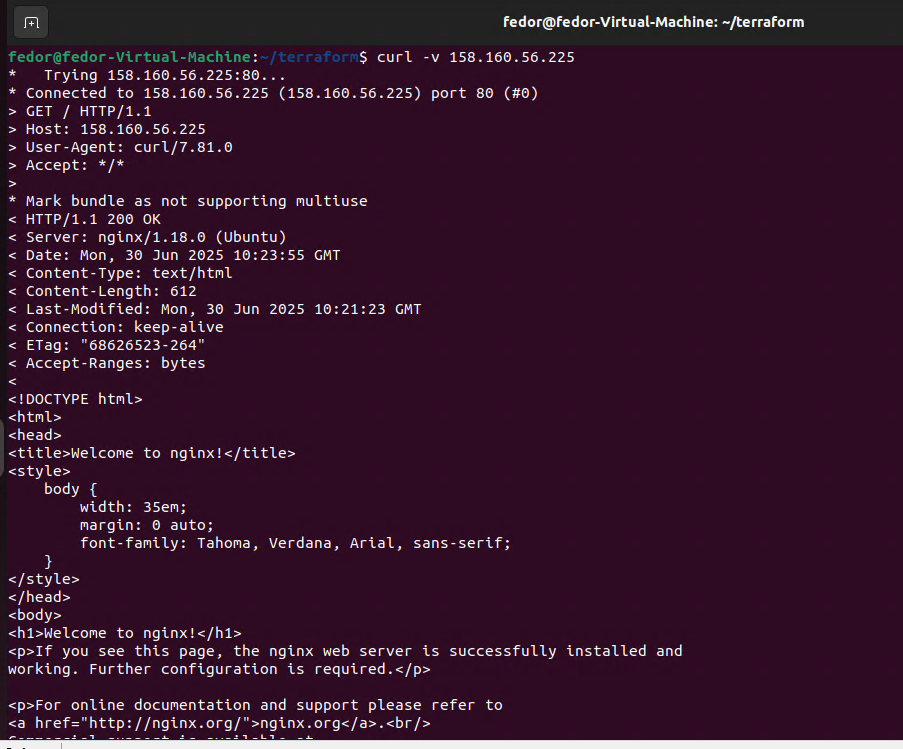
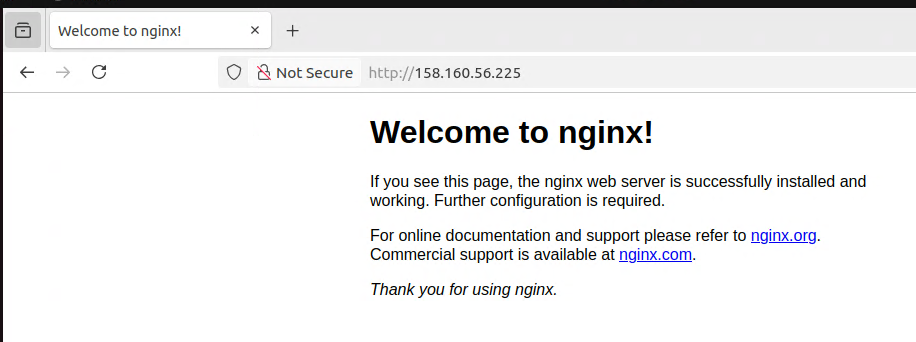
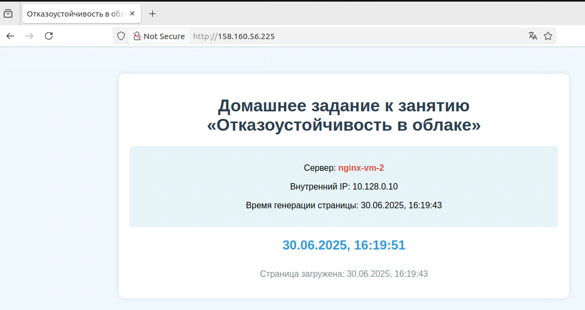
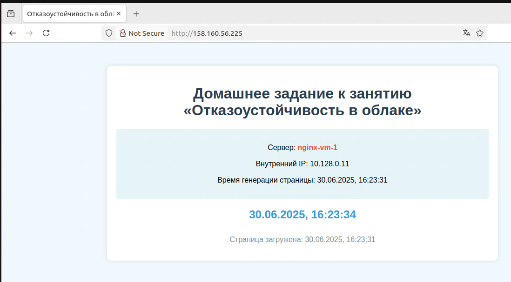

# Домашнее задание к занятию «Отказоустойчивость в облаке»

## Задание 1 

Возьмите за основу [решение к заданию 1 из занятия «Подъём инфраструктуры в Яндекс Облаке»](https://github.com/netology-code/sdvps-homeworks/blob/main/7-03.md#задание-1).

1. Теперь вместо одной виртуальной машины сделайте terraform playbook, который:

- создаст 2 идентичные виртуальные машины. Используйте аргумент [count](https://www.terraform.io/docs/language/meta-arguments/count.html) для создания таких ресурсов;
- создаст [таргет-группу](https://registry.terraform.io/providers/yandex-cloud/yandex/latest/docs/resources/lb_target_group). Поместите в неё созданные на шаге 1 виртуальные машины;
- создаст [сетевой балансировщик нагрузки](https://registry.terraform.io/providers/yandex-cloud/yandex/latest/docs/resources/lb_network_load_balancer), который слушает на порту 80, отправляет трафик на порт 80 виртуальных машин и http healthcheck на порт 80 виртуальных машин.

Рекомендуем изучить [документацию сетевого балансировщика нагрузки](https://cloud.yandex.ru/docs/network-load-balancer/quickstart) для того, чтобы было понятно, что вы сделали.

2. Установите на созданные виртуальные машины пакет Nginx любым удобным способом и запустите Nginx веб-сервер на порту 80.

3. Перейдите в веб-консоль Yandex Cloud и убедитесь, что: 

- созданный балансировщик находится в статусе Active,
- обе виртуальные машины в целевой группе находятся в состоянии healthy.

4. Сделайте запрос на 80 порт на внешний IP-адрес балансировщика и убедитесь, что вы получаете ответ в виде дефолтной страницы Nginx.

*В качестве результата пришлите:*

*1. Terraform Playbook.*

*2. Скриншот статуса балансировщика и целевой группы.*

*3. Скриншот страницы, которая открылась при запросе IP-адреса балансировщика.*

---

providers.tf
```hcl
terraform {
  required_version = ">= 1.8.4"

  required_providers {
    yandex = {
      source  = "yandex-cloud/yandex"
      version = "~> 0.129.0"
    }
  }
}

provider "yandex" {
  cloud_id                 = var.cloud_id
  folder_id                = var.folder_id
  service_account_key_file = file("~/authorized_key.json")
}
```

variables.tf
```hcl
variable "cloud_id" {
  description = "ID облака"
  type        = string
  default     = "bb1gvp4hi1rte6hlv8prc"
}

variable "folder_id" {
  description = "ID папки"
  type        = string
  default     = "b1g2s09li3uocu4pfl1s"
}

variable "vm_resources" {
  description = "Ресурсы ВМ: ядра, память, доля CPU"
  type = object({
    cores         = number
    memory        = number
    core_fraction = number
  })
  default = {
    cores         = 2
    memory        = 1
    core_fraction = 20
  }
}
```

network.tf
```hcl
resource "yandex_vpc_network" "network" {
  name      = "develop-fops"
  folder_id = var.folder_id
}

resource "yandex_vpc_subnet" "subnet_a" {
  name           = "develop-fops-subnet-a"
  network_id     = yandex_vpc_network.network.id
  folder_id      = var.folder_id
  zone           = "ru-central1-a"
  v4_cidr_blocks = ["10.128.0.0/24"]
}

resource "yandex_vpc_address" "lb_ip" {
  name      = "nginx-lb-address"
  folder_id = var.folder_id

  external_ipv4_address {
    zone_id = "ru-central1-a"
  }
}

resource "yandex_lb_target_group" "target_group" {
  name      = "nginx-target-group"
  folder_id = var.folder_id

  dynamic "target" {
    for_each = yandex_compute_instance.vm
    content {
      address   = target.value.network_interface[0].ip_address  # Используем внутренний IP
      subnet_id = yandex_vpc_subnet.subnet_a.id
    }
  }
}

resource "yandex_lb_network_load_balancer" "nlb" {
  name      = "nginx-lb"
  folder_id = var.folder_id

  listener {
    name        = "http-listener"
    port        = 80
    protocol    = "tcp"
    target_port = 80

    external_address_spec {
      address    = yandex_vpc_address.lb_ip.external_ipv4_address[0].address  # Используем статический IP
      ip_version = "ipv4"
    }
  }

  attached_target_group {
    target_group_id = yandex_lb_target_group.target_group.id

    healthcheck {
      name                = "http-hc"
      interval            = 5
      timeout             = 3
      healthy_threshold   = 2
      unhealthy_threshold = 3

      http_options {
        path = "/"
        port = 80
      }
    }
  }
}

output "lb_ip_address" {
  description = "Внешний IP балансировщика"
  value       = yandex_vpc_address.lb_ip.external_ipv4_address[0].address
}
```

vms.tf
```hcl
data "yandex_compute_image" "ubuntu_2204_lts" {
  family = "ubuntu-2204-lts"
}

resource "yandex_compute_instance" "vm" {
  count       = 2
  name        = "nginx-vm-${count.index + 1}"
  zone        = "ru-central1-a"
  platform_id = "standard-v1"

  boot_disk {
    initialize_params {
      image_id = data.yandex_compute_image.ubuntu_2204_lts.id
      size     = 10
      type     = "network-hdd"
    }
  }

  network_interface {
    subnet_id = yandex_vpc_subnet.subnet_a.id
    nat       = true
  }

  resources {
    cores         = var.vm_resources.cores
    memory        = var.vm_resources.memory
    core_fraction = var.vm_resources.core_fraction
  }

  metadata = {
    user-data = file("./cloud-init.yml")
  }
}
```

cloud-init.yml
```yml
#cloud-config
package_update: true
package_upgrade: true

users:
  - name: user
    groups: sudo
    shell: /bin/bash
    sudo: ["ALL=(ALL) NOPASSWD:ALL"]
    ssh_authorized_keys:
      - ssh-ed25519 AAAAC3NzaC1lZDI1NTE5AAAAIE+3JUVgdmLQ8WftYeJSjh31EsYUn1+mMqCp32qKwz fedor@fedor-Virtual-Machine

packages:
  - nginx

runcmd:
  - systemctl start nginx
  - systemctl enable nginx
```












